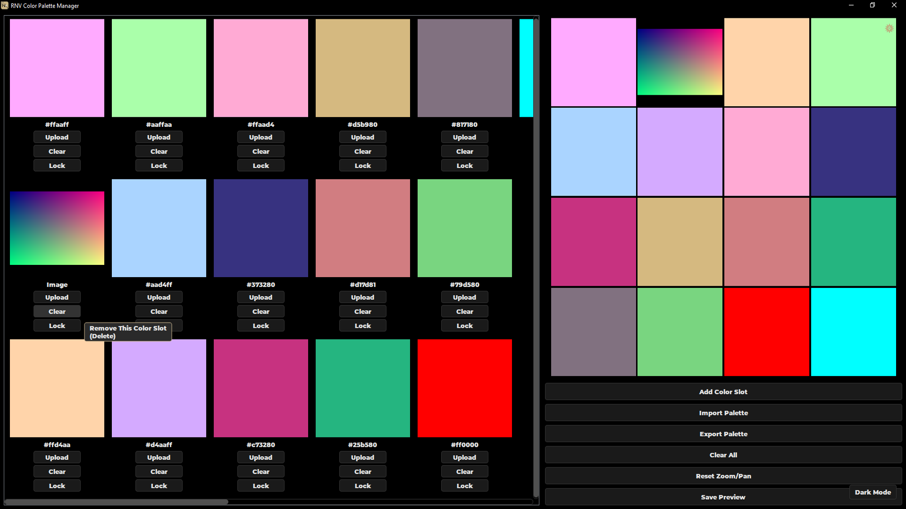
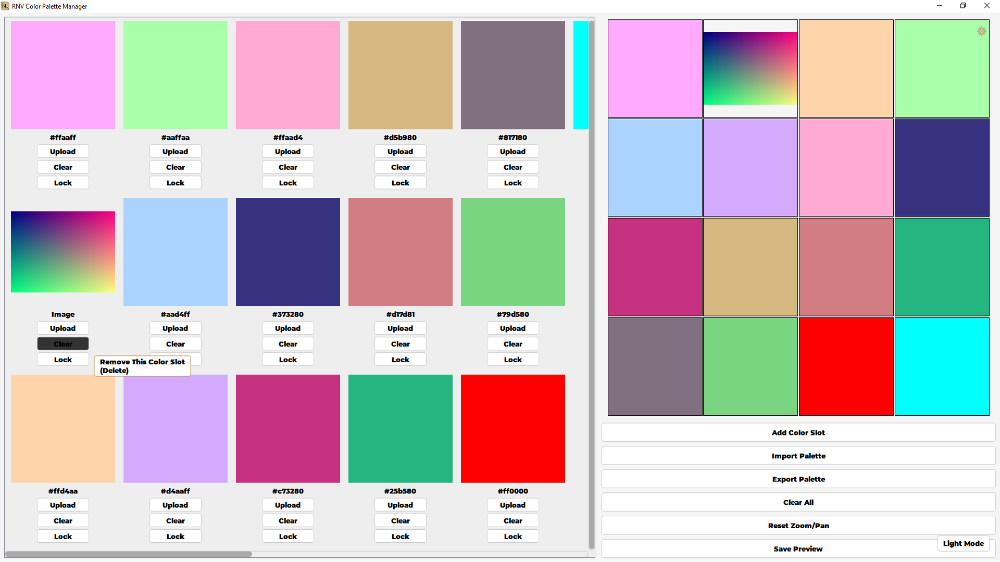
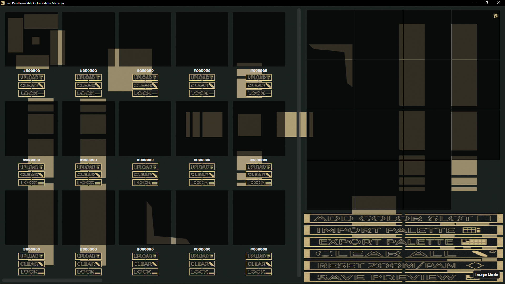
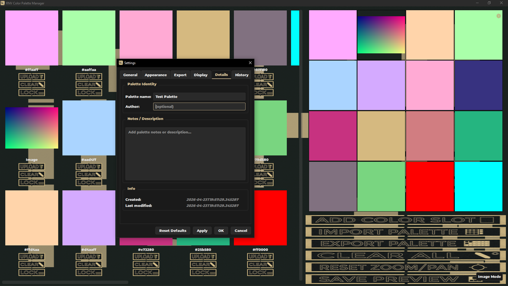
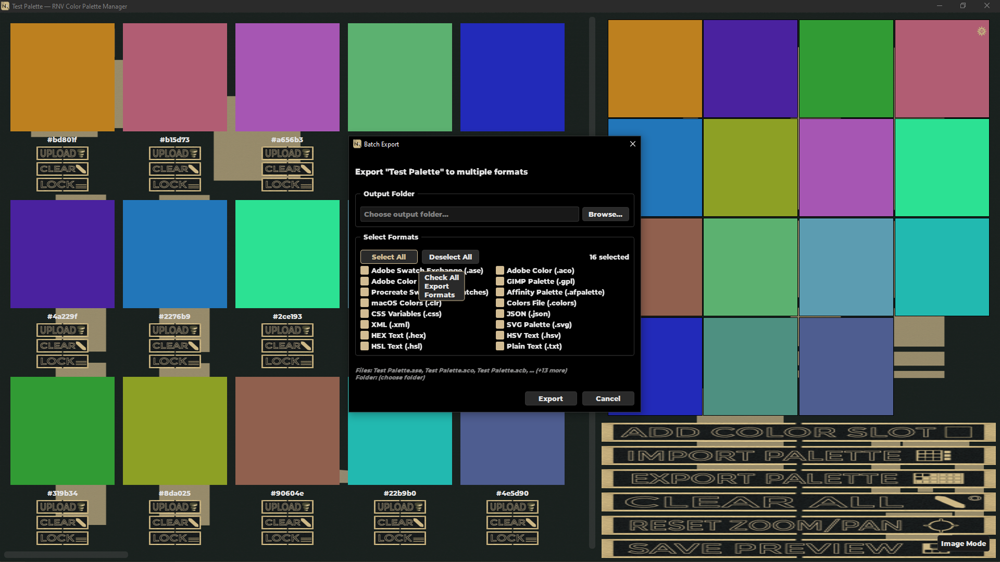
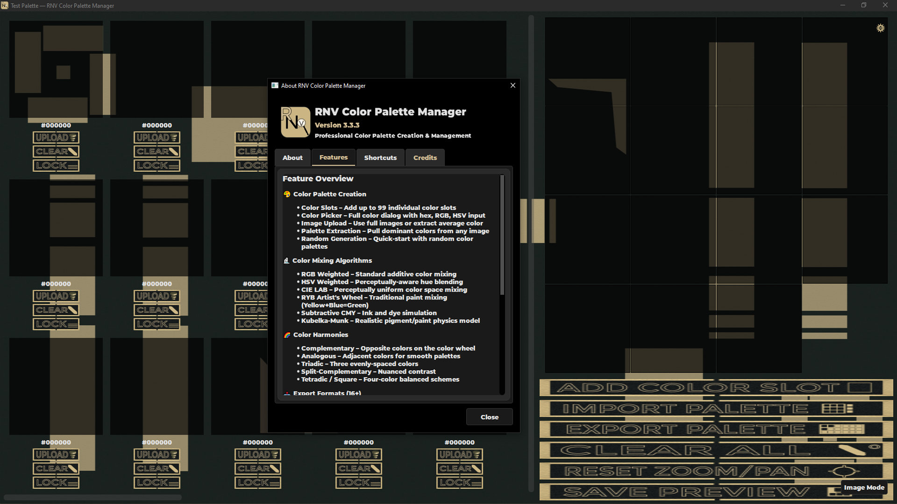

# RNV Color Palette Manager

A professional desktop application for creating, managing, and exporting color palettes — built with Python 3.13 and PyQt6.

[](https://www.python.org/downloads/)
[](https://pypi.org/project/PyQt6/)
[]()
[](LICENSE)
[]()
[](https://github.com/RNVizion/rnv-color-palette-manager/actions/workflows/tests.yml)
[]()
[]()

---

## Overview

RNV Color Palette Manager is a feature-rich color palette management tool designed for artists, designers, and developers. It supports advanced color mixing algorithms (CIE LAB, Kubelka-Munk, RYB), color harmony generation, accessibility contrast checking, and export to 16+ professional palette formats including Adobe ASE/ACO, GIMP GPL, Procreate, and Affinity Designer.

The application features three visual themes (Dark, Light, and Image mode with custom backgrounds), a comprehensive keyboard shortcut system, session auto-save with crash recovery, and a clean modular architecture split into `core/`, `ui/`, and `utils/` packages.

## Screenshots

<p align="center">
  
  
  
</p>
<p align="center"><em>Three theme modes — Dark, Light, and Image (left to right)</em></p>

<p align="center">
  
  
</p>
<p align="center"><em>Tabbed Settings dialog (left) and Batch Export to multiple formats (right)</em></p>

<p align="center">
  
</p>
<p align="center"><em>About dialog — documentation, shortcuts, and credits</em></p>

## Features

### Color Palette Management
- Up to 99 individual color slots per palette
- Named slot groups with collapse/expand and drag-and-drop reordering
- Per-slot locking to protect colors during bulk operations
- Palette metadata (name, author, description, timestamps)
- Full undo/redo history (50-action depth)

### Color Creation & Mixing
- **Color picker** with hex, RGB, and HSV input
- **Image-based extraction** — upload any image, use its average color, or extract a k-means palette
- **Random generation** — single vivid colors or harmonious 3/6/9-color palettes
- **Color harmonies** — complementary, analogous, triadic, split-complementary, tetradic, monochromatic
- **Gradient generation** between any two slots
- **Seven mixing algorithms** — RGB weighted, HSV weighted, CIE LAB perceptual, RYB artist's wheel, subtractive CMY, and Kubelka-Munk pigment simulation

### Accessibility
- **WCAG 2.1 contrast ratio checker** with AA/AAA pass indicators for normal and large text
- **Color blindness simulation** — Protanopia, Deuteranopia, and Tritanopia preview modes

### Import / Export
- **16+ supported formats** for both import and export (see table below)
- **Batch export** — write the palette to multiple formats in a single operation
- **Recent palettes** menu with quick reload
- **Export history** tracking with file size and color count

### Interface & UX
- Three visual themes — Dark, Light, and Image Mode with custom background support
- Zoomable and pannable workspace
- Inline color search by hex, RGB, CSS name, or group name
- Persistent settings via platform-native storage (Windows Registry, macOS plist, Linux conf)
- Session auto-save and crash recovery
- Custom themed tooltips with branded styling
- Comprehensive keyboard shortcuts

## Supported Formats

| Format | Extension | Import | Export | Notes |
|---|---|:---:|:---:|---|
| Adobe Swatch Exchange | `.ase` | ✓ | ✓ | Photoshop, Illustrator, InDesign |
| Adobe Color | `.aco` | ✓ | ✓ | Photoshop |
| Adobe Color Book | `.acb` |   | ✓ | Photoshop libraries |
| GIMP Palette | `.gpl` | ✓ | ✓ | GIMP, Inkscape, Krita |
| Procreate Swatches | `.swatches` | ✓ | ✓ | iPad Procreate |
| Affinity Palette | `.afpalette` | ✓ | ✓ | Affinity Designer/Photo/Publisher |
| macOS Colors | `.clr` | ✓ | ✓ | System color picker |
| Colors File | `.colors` | ✓ | ✓ | KDE |
| CSS Variables | `.css` | ✓ | ✓ | Web development |
| JSON | `.json` | ✓ | ✓ | Universal data interchange |
| XML | `.xml` | ✓ | ✓ | Structured metadata |
| SVG Palette | `.svg` | ✓ | ✓ | Visual reference |
| HEX Text | `.hex` | ✓ | ✓ | Plain hex values |
| HSV Text | `.hsv` | ✓ | ✓ | Plain HSV values |
| HSL Text | `.hsl` | ✓ | ✓ | Plain HSL values |
| Plain Text | `.txt` | ✓ | ✓ | Tab-separated |

## Installation

### Requirements
- Python 3.13 or higher
- PyQt6 6.5+
- Pillow 10.0+

### Clone and install
```bash
git clone https://github.com/RNVizion/rnv-color-palette-manager.git
cd rnv-color-palette-manager
pip install -r requirements.txt
```

Alternatively, install as a package using the included `pyproject.toml`:
```bash
pip install .
```

### Run
```bash
python RNV_Color_Palette_Manager.py
```

### Build a standalone executable (optional)

A PyInstaller spec file is included for building a single-file executable that bundles Python, PyQt6, Pillow, and all resources into one downloadable binary. This is useful for sharing the app with users who don't have Python installed.

```bash
pip install pyinstaller
pyinstaller RNV_Color_Palette_Manager.spec
```

The output is written to `dist/`:
- **Windows:** `dist/RNV_Color_Palette_Manager.exe`
- **macOS / Linux:** `dist/RNV_Color_Palette_Manager`

The spec file defaults to one-file mode (single executable, slightly slower first launch). Edit `RNV_Color_Palette_Manager.spec` to switch to one-folder mode for faster startup — instructions are in the spec file's comments.

## Usage

Launch the app and the main workspace opens with a default grid of color slots. Click any slot to open the color picker, right-click for a context menu, or drag to reorder. The right panel provides buttons for Add Slot, Import/Export, Clear All, Reset Zoom/Pan, and Save Preview.

### Keyboard Shortcuts

| Shortcut | Action |
|---|---|
| `Ctrl+N` | Add new color slot |
| `Ctrl+I` | Import palette |
| `Ctrl+E` | Export palette |
| `Ctrl+Shift+E` | Batch export to multiple formats |
| `Ctrl+S` | Save preview as image |
| `Ctrl+D` | Duplicate selected slot |
| `Ctrl+C` | Copy hex of selected slot |
| `Ctrl+Z` / `Ctrl+Y` | Undo / Redo |
| `Ctrl+F` | Toggle color search bar |
| `Ctrl+T` | Cycle theme (Dark → Light → Image) |
| `Ctrl+R` | Reset zoom and pan |
| `Ctrl+,` | Open Settings |
| `Ctrl+/` | Open About / Help |
| `Delete` | Remove selected slot |
| `Space` | Toggle lock on selected slot |
| `←` / `→` | Navigate between slots |
| `F10` | Toggle fullscreen |
| `F11` | Toggle tooltips |
| `F12` | Toggle size overlay |

## Project Architecture

```
RNV_Color_Palette_Manager/
├── README.md                       # This file
├── ARCHITECTURE.md                 # Design decisions & tradeoffs
├── TESTING.md                      # Test suite guide & patterns
├── LICENSE                         # MIT license
├── .gitignore                      # Python / IDE / OS ignores
├── pyproject.toml                  # PEP 621 project metadata
├── requirements.txt                # Quick-install dependencies
├── requirements-dev.txt            # Test/benchmark dependencies (optional)
├── RNV_Color_Palette_Manager.py    # Main application entry point
├── RNV_Color_Palette_Manager.spec  # PyInstaller build spec
├── test_rnv_palette_manager.py     # unittest baseline suite (374 tests)
├── run_tests.py                    # Unified runner for both test suites
├── .coveragerc                     # Coverage configuration
├── clean_python_cache.bat          # Dev convenience (Windows)
├── clean_python_cache.sh           # Dev convenience (macOS / Linux)
├── __init__.py                     # Root package marker
├── py.typed                        # PEP 561 typing marker
│
├── .github/
│   └── workflows/
│       └── tests.yml               # CI: runs full suite on every push/PR
│
├── core/                           # Color science & palette logic
│   ├── __init__.py
│   ├── py.typed
│   ├── color_math.py               # Color space conversions & mixing
│   ├── color_harmonies.py          # Harmony & gradient generation
│   ├── color_extractor.py          # K-means palette extraction
│   ├── color_slot.py               # Color slot widget & model
│   ├── palette_formats.py          # 16+ format import/export
│   ├── palette_metadata.py         # Palette name, author, timestamps
│   └── accessibility.py            # WCAG contrast & CVD simulation
│
├── ui/                             # Qt widgets & theming
│   ├── __init__.py
│   ├── py.typed
│   ├── colors.py                   # Single source of truth for theme colors
│   ├── theme_manager.py            # Dark / Light / Image mode switching
│   ├── image_button.py             # Custom button with image-mode support
│   ├── image_upload_dialog.py      # Image upload workflow
│   ├── preview_grid.py             # Palette preview widget
│   ├── zoomable_graphics_view.py   # Zoom and pan workspace
│   ├── settings_dialog.py          # Tabbed preferences dialog
│   ├── about_dialog.py             # About / Help dialog
│   ├── slot_group.py               # Slot group data & header widget
│   ├── color_search.py             # Inline search bar
│   └── batch_export_dialog.py      # Multi-format export dialog
│
├── utils/                          # Infrastructure & helpers
│   ├── __init__.py
│   ├── py.typed
│   ├── config.py                   # Central config & resource paths
│   ├── logger.py                   # Colored console + file logging
│   ├── font_loader.py              # Custom font loading with fallback
│   ├── dialog_helper.py            # Themed message boxes
│   ├── error_handler.py            # Safe execution wrappers & validation
│   ├── file_utils.py               # Path handling & file operations
│   ├── pixmap_cache.py             # LRU cache for QPixmap objects
│   ├── settings_manager.py         # Persistent preferences (QSettings)
│   ├── session_manager.py          # Auto-save & crash recovery
│   ├── export_history.py           # Recent export tracking
│   ├── undo_manager.py             # Undo/redo stack
│   ├── recent_palettes.py          # Recent file menu
│   └── color_history.py            # Color change history panel
│
├── tests/                          # Modern pytest suite (371 tests)
│   ├── conftest.py                 # Shared fixtures & helpers
│   ├── test_color_math_properties.py    # Hypothesis property tests
│   ├── test_export_snapshots.py         # Export format snapshots
│   ├── test_import_snapshots.py         # Import format snapshots
│   ├── test_qt_main_window.py           # MainWindow interaction tests
│   ├── test_qt_color_slot.py            # Slot mouse/click tests
│   ├── test_qt_color_slot_paint.py      # paintEvent pixel tests
│   ├── test_qt_drag_drop.py             # Drag/drop event handlers
│   ├── test_qt_search_and_workflows.py  # Search bar & end-to-end flows
│   ├── test_qt_infrastructure.py        # pytest-qt smoke tests
│   ├── test_error_handler.py            # error_handler.py logic
│   ├── test_error_handler_extras.py     # Validator coverage
│   ├── test_file_utils.py               # FileUtils helper tests
│   ├── test_session_manager.py          # SessionManager + state tests
│   ├── test_perf_color_math.py          # Color math benchmarks
│   └── test_perf_palette_io.py          # Palette I/O benchmarks
│
└── resources/                      # Bundled assets
    ├── button_images/               # Button icon images (base/hover/pressed)
    ├── background_images/           # Optional Image Mode backgrounds
    ├── fonts/                       # Bundled Montserrat font
    ├── icons/                       # Application icons
    └── screenshots/                 # README preview images
```

## Testing

The project ships with a comprehensive test suite — **745 tests across two coexisting suites**, covering pure logic, Qt widget interactions, paint rendering, drag-and-drop, palette format roundtrips, and performance benchmarks.

### Quick start

```bash
pip install -r requirements-dev.txt   # First-time setup
python run_tests.py                   # Run both suites + coverage report
```

### What's tested

| Suite | Tests | Description |
|---|---|---|
| **unittest** (`test_rnv_palette_manager.py`) | 374 | Frozen baseline: pure logic, validators, palette format roundtrips, MainWindow integration smoke tests, undo/redo, settings, color history. |
| **pytest** (`tests/`) | 371 | Modern suite: Hypothesis property tests, format snapshots, pytest-qt interaction tests, paint event pixel sampling, drag-and-drop event handlers, performance benchmarks. |

**Coverage:** 70% project-wide (96% on `core/color_math`, 94% on `utils/session_manager`, 89% on `utils/file_utils`, 84% on `utils/error_handler`, with the remaining gap concentrated in modal dialogs deliberately excluded from offscreen testing).

### Continuous Integration

A GitHub Actions workflow runs the full suite on Windows with Python 3.13 on every push and pull request. Status visible at the top of this README.

### Performance benchmarks

The pytest suite includes 25 benchmarks tracking hot-path code (color space conversions, mixing algorithms, palette I/O). Run them in isolation:

```bash
python -m pytest tests/test_perf_*.py --benchmark-only
```

For the full guide to the test architecture, patterns for testing PyQt6 widgets in offscreen mode, and diagnostic tips, see [TESTING.md](TESTING.md).

## Tech Stack

- **Language:** Python 3.13 (leveraging `match/case`, `type` aliases, `|` union syntax, `pathlib`, `Final` annotations)
- **UI Framework:** PyQt6
- **Image Processing:** Pillow (PIL)
- **Testing:** Python `unittest`, pytest, pytest-qt, Hypothesis, pytest-benchmark, coverage.py
- **CI:** GitHub Actions (Windows runners, Python 3.13)
- **Color Science:** CIE 1976 L\*a\*b\*, Kubelka-Munk pigment theory, RYB artist color wheel, sRGB gamma correction

## Design Principles

- **Single source of truth for colors** — all theme values originate from `ui/colors.py`; no hardcoded color literals elsewhere in the codebase
- **Strict package boundaries** — `core/` contains color science with no Qt dependencies beyond widgets, `ui/` handles presentation, `utils/` provides infrastructure
- **Type-annotated throughout** — modern Python 3.13 type hints on all public APIs
- **Fail-safe by default** — every file operation is wrapped in error handling; session state is auto-saved for crash recovery

For the reasoning behind these decisions, platform-specific workarounds, and tradeoffs considered, see [ARCHITECTURE.md](ARCHITECTURE.md).

## License

This project is licensed under the MIT License — see [LICENSE](LICENSE) for details.

## Author

Built by [RNVizion](https://github.com/RNVizion)
